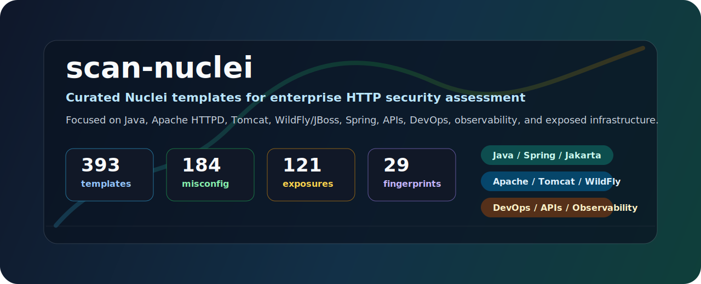

<p align="center">
  
</p>

<h1 align="center">scan-nuclei</h1>

<p align="center">
  Plantillas Nuclei curadas para auditorias HTTP de aplicaciones Java, servidores web, plataformas DevOps y superficies empresariales expuestas.
</p>

<p align="center">
  <a href="https://github.com/projectdiscovery/nuclei"></a>
  
  
  
</p>

---

## Vision General

`scan-nuclei` es una coleccion profesional de plantillas para ejecutar con [Nuclei](https://github.com/projectdiscovery/nuclei) sobre objetivos HTTP/HTTPS. El repositorio esta especialmente orientado a stacks Java empresariales y a la superficie que suele quedar publicada alrededor de ellos: Apache HTTPD, Tomcat, WildFly/JBoss, Spring Boot, Quarkus, Micronaut, Jetty, consolas administrativas, DevOps, documentacion API, observabilidad y ficheros sensibles.

El objetivo es que una primera ejecucion proporcione contexto accionable: tecnologia detectada, paneles expuestos, endpoints no autenticados, artefactos sensibles, configuraciones peligrosas y CVEs potenciales que requieren validacion manual.

## Cobertura

| Familia | Plantillas | Enfoque |
| --- | ---: | --- |
| `misconfiguration/` | 184 | Consolas, endpoints administrativos, hardening HTTP, proxies, observabilidad, infraestructura y plataformas Java |
| `exposures/` | 121 | Ficheros sensibles, OpenAPI/Swagger/Knife4j, WSDL/WADL, sourcemaps, logs, heapdumps y artefactos publicados |
| `vulnerabilities/` | 36 | Riesgos explotables o de alto impacto sin CVE unica, principalmente Spring, servlets, Micronaut y Struts |
| `technologies/` | 29 | Fingerprinting de Apache, Tomcat, WildFly, Jetty, Spring Boot, Quarkus, Micronaut y Java Web |
| `cves/` | 21 | Checks no intrusivos para Apache HTTPD, Tomcat y ecosistema Java/JBoss/Spring/Struts |
| `default-logins/` | 2 | Credenciales por defecto en superficies Tomcat/Manager |

La matriz completa vive en [COVERAGE-MATRIX.md](COVERAGE-MATRIX.md).

## Superficies Cubiertas

| Area | Ejemplos |
| --- | --- |
| Java empresarial | Spring Boot, Spring Cloud, Jakarta/JSF, Struts, Axis2, CXF, Vaadin, Dubbo, Camunda, Flowable, XXL-JOB, Apollo, Sentinel, Hystrix |
| Servidores y middleware | Apache HTTPD, Tomcat, WildFly/JBoss, Jetty, Undertow, Nginx, WebLogic, WebSphere, GlassFish/Payara, Karaf/Felix |
| DevOps y supply chain | Jenkins, GitLab, Nexus, Artifactory, SonarQube, Argo CD, Harbor |
| APIs y documentacion | OpenAPI, Swagger UI, Swagger config, Knife4j, WSDL, WADL, GraphQL |
| Observabilidad e infraestructura | Prometheus, Alertmanager, Grafana, cAdvisor, etcd, Consul, Vault, Docker Registry, Kubernetes |
| Ficheros sensibles | `.git`, configs Java/Spring/Tomcat/WildFly, keystores, logs, WAR/JAR, `WEB-INF`, JMX remote, `SESSIONS.ser`, JSP compilados |

## Instalacion Rapida

### Linux

```bash
sudo apt update
sudo apt install -y git curl unzip golang-go
go install -v github.com/projectdiscovery/nuclei/v3/cmd/nuclei@latest
export PATH="$PATH:$(go env GOPATH)/bin"
git clone https://github.com/p3ix/scan-nuclei.git
cd scan-nuclei
nuclei -validate -t ./templates
```

Para dejar Nuclei disponible de forma permanente en Bash:

```bash
echo 'export PATH="$PATH:$(go env GOPATH)/bin"' >> ~/.bashrc
source ~/.bashrc
```

### Windows

Instala Git desde <https://git-scm.com/download/win> y Go desde <https://go.dev/dl/>. Despues, en PowerShell:

```powershell
go install -v github.com/projectdiscovery/nuclei/v3/cmd/nuclei@latest
[Environment]::SetEnvironmentVariable("Path", $env:Path + ";$env:USERPROFILE\go\bin", "User")
git clone https://github.com/p3ix/scan-nuclei.git
cd scan-nuclei
nuclei -validate -t .\templates
```

Cierra y vuelve a abrir PowerShell si `nuclei` no aparece inmediatamente en el `PATH`.

## Uso

Escaneo completo contra un objetivo:

```bash
nuclei -t ./templates -u https://objetivo
```

Windows:

```powershell
nuclei -t .\templates -u https://objetivo
```

Primera pasada reduciendo ruido:

```bash
nuclei -t ./templates -u https://objetivo -severity critical,high,medium
```

Guardar resultados:

```bash
nuclei -t ./templates -u https://objetivo -o resultados.txt
```

Salida JSONL para integracion con pipelines:

```bash
nuclei -t ./templates -u https://objetivo -jsonl -o resultados.jsonl
```

Objetivos con certificado interno o SNI delicado:

```bash
nuclei -t ./templates -u https://192.168.0.18:8443/ -tls-sni 192.168.0.18
```

Escanear una lista de hosts:

```bash
nuclei -t ./templates -l targets.txt -severity critical,high,medium -jsonl -o resultados.jsonl
```

## Flujos Recomendados

| Escenario | Comando |
| --- | --- |
| Triage rapido | `nuclei -t ./templates -u https://objetivo -severity critical,high` |
| Auditoria completa | `nuclei -t ./templates -u https://objetivo` |
| Inventario tecnologico | `nuclei -t ./templates/technologies -u https://objetivo` |
| Superficie Java | `nuclei -t ./templates/misconfiguration/java-apps -t ./templates/vulnerabilities/spring -u https://objetivo` |
| Apache/Tomcat/WildFly | `nuclei -t ./templates/misconfiguration/apache -t ./templates/misconfiguration/tomcat -t ./templates/misconfiguration/wildfly -u https://objetivo` |
| Ficheros sensibles | `nuclei -t ./templates/exposures/sensitive-paths -u https://objetivo` |

## Estructura del Repositorio

```text
scan-nuclei/
+-- templates/
|   +-- cves/                 # CVEs concretos y checks potenciales
|   +-- default-logins/       # Credenciales por defecto
|   +-- exposures/            # Ficheros, APIs, logs, dumps y artefactos expuestos
|   +-- misconfiguration/     # Consolas, endpoints, hardening y configuraciones inseguras
|   +-- technologies/         # Fingerprinting y version disclosure
|   +-- vulnerabilities/      # Riesgos sin CVE unica o genericos de framework
+-- COVERAGE-MATRIX.md        # Matriz de cobertura por carpeta y prioridad
+-- README.md
```

## Como Interpretar Resultados

| Severidad | Lectura recomendada |
| --- | --- |
| `critical` / `high` | Revisar primero. Normalmente implican secretos, administracion expuesta, acceso no autenticado o superficie explotable. |
| `medium` | Superficie util para ataque, fuga operativa o mala configuracion que conviene cerrar. |
| `low` | Hardening y postura defensiva. |
| `info` | Fingerprinting y contexto tecnologico. No es vulnerabilidad por si solo. |

Los templates con sufijo `-potential` indican una condicion compatible con una vulnerabilidad o configuracion peligrosa, pero deben validarse manualmente antes de reportarse como confirmados.

## Buenas Practicas

- Ejecuta primero `nuclei -validate -t ./templates` despues de actualizar el repositorio.
- Prioriza hallazgos `critical`, `high`, `default-login`, `*-management-unauth`, `heapdump`, `env`, `jmx`, `keystore`, `server.xml`, `standalone.xml` y logs sensibles.
- Agrupa resultados por tecnologia: los fingerprints ayudan a decidir que familias revisar primero.
- Usa `-jsonl` cuando quieras integrar resultados con SIEM, pipelines o herramientas propias.
- Valida manualmente los `*-potential`; estan pensados para ser no intrusivos y evitar explotacion activa.
- Ejecuta solo contra sistemas propios o con autorizacion explicita.

## Mantenimiento

Actualizar el motor:

```bash
nuclei -update
```

Actualizar este repositorio:

```bash
git pull
nuclei -validate -t ./templates
```

Comprobar numero de plantillas:

```bash
find templates -name '*.yaml' | wc -l
```

## Licencia

Este proyecto se distribuye bajo licencia MIT. Consulta [LICENSE](LICENSE).
